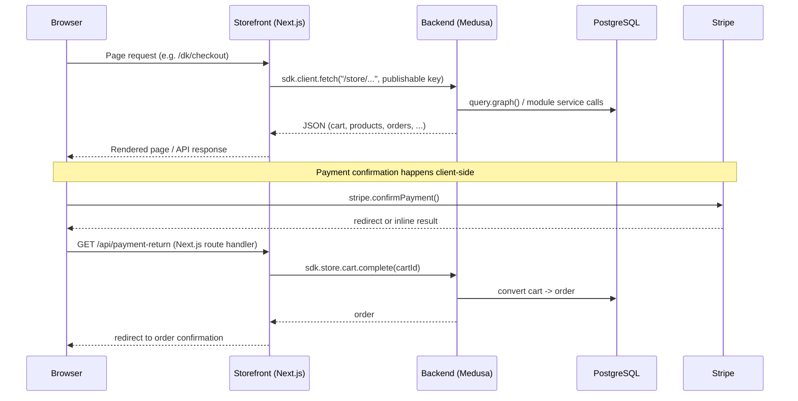

# System Overview

## Applications and their boundaries

| App | Responsibility | Talks to |
|---|---|---|
| `apps/backend` (`@dtc/backend`) | Medusa v2 commerce engine: catalog, cart, checkout completion, orders, customers, payments, fulfillment, admin dashboard. Owns the PostgreSQL database. | PostgreSQL; Stripe (payment provider, server-side); Shopify Admin API (via the sync plugin, uncommitted — see [integrations.md](integrations.md)) |
| `apps/storefront` (`@dtc/storefront`) | Customer-facing Next.js site: browsing, cart, checkout UI, account pages. Holds no persistent state of its own beyond cookies (cart id, auth token, locale). | `apps/backend`'s HTTP API only, via `@medusajs/js-sdk` (`sdk.client.fetch` / `sdk.store.*`); Stripe.js in the browser for card entry |

There is no shared runtime or shared database between the two apps — they are independent processes that communicate only over the Medusa HTTP API. The storefront never talks to PostgreSQL, Stripe's server API, or Shopify directly for order data; it goes through the backend.

## Request flow (typical)

See [../workflows/checkout.md](../workflows/checkout.md) for the fully traced version of this flow with file paths.

## Background processing

None is implemented. `apps/backend/src/jobs` and `apps/backend/src/subscribers` contain only the Medusa-generated boilerplate examples — no scheduled job or event subscriber runs in this codebase today. The Shopify sync plugin (uncommitted) adds its own webhook receivers and manual-trigger sync, described in [integrations.md](integrations.md); it is separate from this app's own subscriber/job directories.

## Authentication and authorization

- **Storefront ↔ backend (store API)**: a publishable API key (`NEXT_PUBLIC_MEDUSA_PUBLISHABLE_KEY`), sent automatically by `@medusajs/js-sdk`. Customer sessions use Medusa's customer auth (JWT/cookie), managed by the SDK and `apps/storefront/src/lib/data/customer.ts` (`login`, `signup`, `signout`).
- **Admin dashboard**: served by the backend itself (`@medusajs/dashboard`) at `/app`, using Medusa's own admin auth. No custom admin auth logic exists in this repo.
- **Backend config**: `apps/backend/medusa-config.ts` sets `jwtSecret` and `cookieSecret` from environment variables (`JWT_SECRET`, `COOKIE_SECRET`); CORS is controlled by `STORE_CORS` / `ADMIN_CORS` / `AUTH_CORS`.

## Failure boundaries

- A backend outage fails all storefront data fetches; the storefront has no independent data store or offline mode.
- A Stripe outage or error blocks payment confirmation only — cart/browsing continues to work; see [../domains/payments.md](../domains/payments.md) for how the checkout UI surfaces payment failures.
- The Shopify sync plugin's webhook/manual-sync failures are isolated to its own `shopify_webhook_log` table and admin log page (per its README) and do not block core storefront checkout.

## Source locations

- Workspace definition: `pnpm-workspace.yaml`, `turbo.json`
- Backend entry/config: `apps/backend/medusa-config.ts`
- Storefront SDK client: `apps/storefront/src/lib/config.ts`
- Storefront region/locale routing: `apps/storefront/src/middleware.ts`
